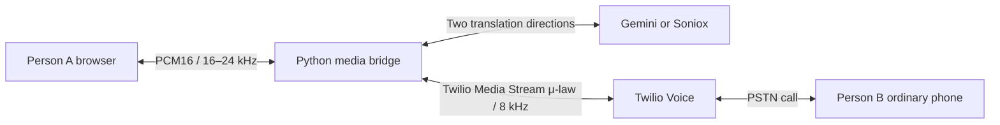

# Architecture and Protocol Notes

Documentation review date: **28 July 2026**

## End-to-end topology

Person B does not install an application. Person A is the only browser
participant.

## Call sequence

1. The dashboard sends credentials to the Python backend over the local/secured
   HTTP connection. The backend holds them in memory and returns an opaque
   configuration ID.
2. The dashboard prepares a call and opens its authenticated browser WebSocket.
3. The backend pre-warms two provider directions.
4. The backend creates an outbound Twilio Call with inline TwiML containing
   `<Connect><Stream>`.
5. Twilio connects `wss://PUBLIC_URL/ws/twilio` and sends the one-time call ID
   and stream token as custom parameters.
6. Browser microphone PCM is sent into the caller-to-callee provider direction.
7. Twilio inbound μ-law is sent into the callee-to-caller provider direction.
8. Translated audio returns to the opposite transport.
9. Source/translated text and telemetry are sent to the dashboard as JSON.

## Official API facts implemented

### Gemini Live Translate

- Model: `gemini-3.5-live-translate-preview`.
- Endpoint:
  `wss://generativelanguage.googleapis.com/ws/google.ai.generativelanguage.v1beta.GenerativeService.BidiGenerateContent`.
- Setup uses `generationConfig.responseModalities: ["AUDIO"]`.
- `translationConfig.targetLanguageCode` selects the output language.
- `echoTargetLanguage` is exposed in the UI.
- Input is raw little-endian PCM16, mono, 16 kHz.
- Output is raw PCM16, mono, 24 kHz.
- Input and output transcriptions are enabled.
- The recommended input chunk is 100 ms. The browser's 4096-sample capture block
  is approximately 85 ms at a 48 kHz input device before conversion.

### Soniox

- STT endpoint: `wss://stt-rt.soniox.com/transcribe-websocket`.
- TTS endpoint: `wss://tts-rt.soniox.com/tts-websocket`.
- STT model: `stt-rt-v5`.
- TTS model: `tts-rt-v1`.
- Each direction uses one-way translation with a selected target language.
- Endpoint detection uses the documented minimum
  `max_endpoint_delay_ms: 500`.
- Translation tokens are streamed to TTS until Soniox emits `<end>`.
- One TTS stream is used per utterance, with a pre-warmed first stream.
- Browser TTS output is `pcm_s16le` at 24 kHz.
- Twilio TTS output is native `pcm_mulaw` at 8 kHz.
- TTS keepalive is sent every 20 seconds.

### Twilio Media Streams

- Outbound calls are created by the Calls REST resource.
- Inline TwiML uses `<Connect><Stream>` for bidirectional media.
- Bidirectional Streams expose only the call's inbound track to the server.
- Incoming media is always `audio/x-mulaw`, 8 kHz, mono.
- Audio sent to Twilio is raw μ-law/8 kHz without file headers and is
  base64-encoded in a `media` message.
- The backend sends periodic `mark` events to observe playback progress.
- The **Clear audio** control sends Twilio's `clear` event.
- The Stream URL contains no query string; call authentication data is passed
  through `<Parameter>` custom parameters.

## Security choices

- Provider and Twilio secrets are never returned by an API response.
- Secrets are stored in process memory only.
- Browser and Twilio media WebSockets each use independent, random one-time
  tokens.
- Phone numbers must use E.164 format.
- CORS permits only the documented local frontend origins.
- No recording or transcript persistence is implemented.

Production work should add application authentication, managed secret storage,
Twilio signature validation, rate limiting and a persistent call-state store.

## Primary documentation

- Google: <https://ai.google.dev/gemini-api/docs/live-api/live-translate>
- Google Live API WebSockets:
  <https://ai.google.dev/gemini-api/docs/live-api/get-started-websocket>
- Soniox speech-to-speech:
  <https://soniox.com/docs/translation/sts-translation>
- Soniox STT WebSocket:
  <https://soniox.com/docs/api-reference/stt/websocket-api>
- Soniox TTS WebSocket:
  <https://soniox.com/docs/api-reference/tts/websocket-api>
- Soniox official STS example:
  <https://github.com/soniox/soniox_examples/tree/master/apps/soniox-speech-to-speech-translation-demo>
- Twilio Media Stream messages:
  <https://www.twilio.com/docs/voice/media-streams/websocket-messages>
- Twilio `<Stream>`:
  <https://www.twilio.com/docs/voice/twiml/stream>
- Twilio Calls resource:
  <https://www.twilio.com/docs/voice/api/call-resource>

